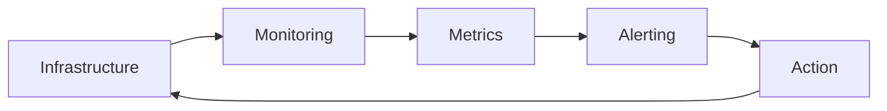
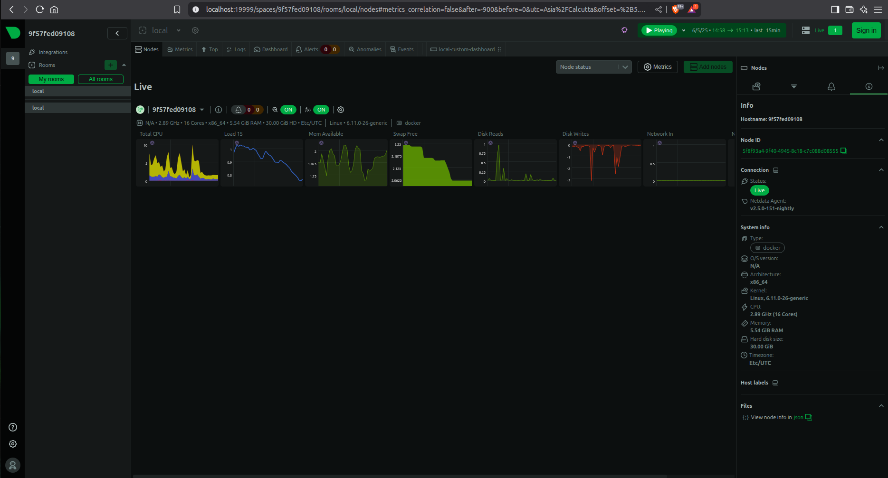
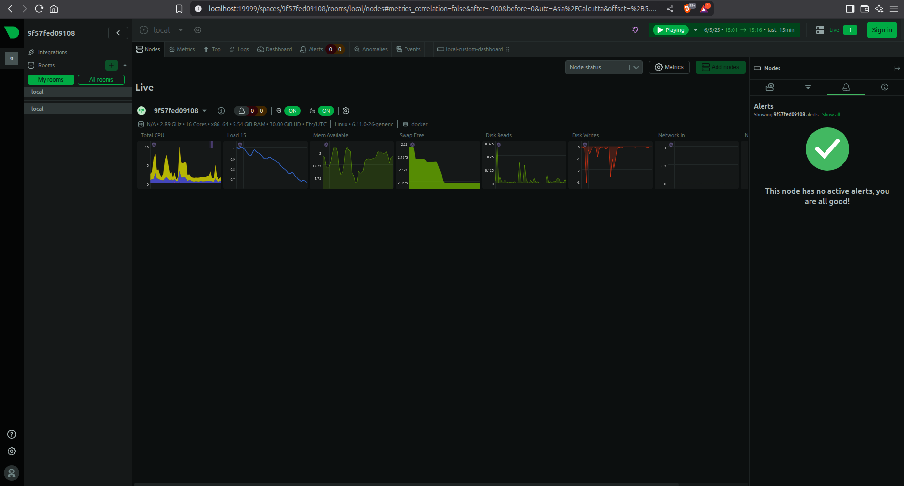
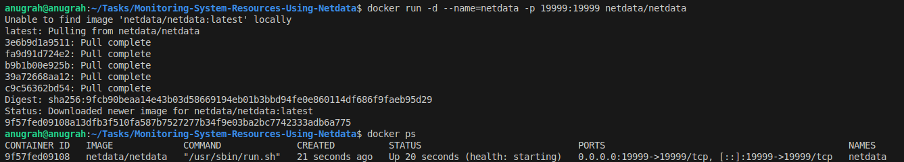

# 🚀 DevOps Internship - Task 7: Real-Time System Monitoring with Netdata  
**Infrastructure Visibility for Performance Optimization**  

[](ScreenShots/dashboard.png)  

## 📋 Task Objective  

Deploy Netdata as a real-time monitoring solution to:  
1. **Detect anomalies** in system resources (CPU throttling, memory leaks, disk saturation)  
2. **Monitor containerized workloads** (Docker resource utilization)  
3. **Implement alerting** for threshold breaches  
4. **Establish visibility** into infrastructure performance golden signals:  
   - Latency  
   - Traffic  
   - Errors  
   - Saturation  

### Success Metrics  
- ✅ Netdata running in Docker container  
- ✅ Dashboard capturing critical system KPIs  
- ✅ Verified alerting mechanism  
- ✅ Documentation of operational insights  

---

## 🔍 Why Monitoring is Foundational in DevOps  

### The Feedback Loop  


1. **Prevent Outages**: Catch disk-full scenarios before they crash apps  
2. **Cost Optimization**: Identify overprovisioned resources (e.g., idle VMs)  
3. **Performance Baselines**: Establish normal behavior to detect anomalies  
4. **Blameless Debugging**: Metric history accelerates root-cause analysis  

### Real-World Impact  
| Failure Mode          | How Netdata Helps                         |
|-----------------------|-------------------------------------------|
| **Memory Leak**       | RAM usage trend alerts before OOM killer  |
| **CPU Throttling**    | Detect sustained >80% usage               |
| **Disk IOPS Saturation** | Identify slow I/O during peak loads      |
| **Container Sprawl**  | Track resource-hungry orphaned containers |

---

## 🛠 Implementation Guide  

### Prerequisites  
- Docker installed ([Linux](https://docs.docker.com/engine/install/ubuntu/), [Windows/macOS](https://docs.docker.com/desktop/))  

### Step 1: Launch Netdata Container  
```bash
docker run -d --name=netdata -p 19999:19999 netdata/netdata
```
- `-d`: Run in background  
- `-p 19999:19999`: Expose dashboard port  

### Step 2: Access Dashboard  
```http
http://localhost:19999  (local machine)  
http://<SERVER_IP>:19999 (remote server)  
```

### Step 3: Monitor Critical DevOps Metrics  
| Section          | Key Metrics                               | DevOps Use Case              |
|------------------|------------------------------------------|------------------------------|
| **System**       | CPU wait time, RAM pressure              | Identify resource bottlenecks |
| **Docker**       | Container CPU throttling, OOM kills      | Debug misbehaving containers  |
| **Network**      | TCP retransmits, bandwidth saturation    | Diagnose connectivity issues  |
| **Alerts**       | Custom threshold breaches                | Proactive incident prevention |

---

## 📸 Screenshots  
| Section             | DevOps Relevance                          | Preview |  
|---------------------|-------------------------------------------|---------|  
| **System Overview** | Baseline performance under load           | [](ScreenShots/dashboard.png) |  
| **Docker Containers** | Container resource efficiency audit       | [](ScreenShots/docker-containers.png) |  
| **Alerts Panel**    | Early-warning system for SLO breaches     | [](ScreenShots/alerts.png) |  
| **Commands Execution**    | Infrastructure-as-Code workflow proof         | [](ScreenShots/commands.png) |  

---

## ❓ Interview Questions (Task 7)  

### 1. What does Netdata monitor?  
**Answer:**  
Netdata auto-discovers and monitors:  
- **System Resources**: CPU, RAM, disk I/O, network interfaces  
- **Containerized Workloads**: Docker/containerd resource usage (CPU throttling, OOM kills)  
- **Applications**: Nginx, MySQL, Apache metrics via 300+ plugins  
- **Custom Metrics**: Python/Node.js apps using `python.d.plugin`  

### 2. How do you view real-time metrics?  
**Answer:**  
Access `http://localhost:19999` (or `http://<SERVER_IP>:19999`) in a browser. Metrics are updated every **1 second** with no configuration required.  

### 3. How is Netdata different from Prometheus?  
**Answer:**  
| **Netdata**                         | **Prometheus**                     |  
|-------------------------------------|------------------------------------|  
| Real-time troubleshooting (1s granularity) | Long-term historical analysis |  
| Automatic metric discovery          | Manual scrape configuration        |  
| All-in-one (UI+storage+collection)  | Requires Grafana + Alertmanager    |  
| Embedded anomaly detection          | Basic alerting rules               |  

### 4. What is a collector?  
**Answer:**  
Lightweight plugins that gather metrics from specific sources:  
- **System Collectors**: `proc.plugin` (Linux kernel metrics)  
- **Container Collectors**: `cgroups.plugin` (Docker/LXC)  
- **App Collectors**: `mysql.plugin` (database queries)  
- **Custom Collectors**: Python scripts in `/etc/netdata/python.d/`  

### 5. What are some performance KPIs to watch?  
**Answer:**  
| KPI                  | Critical Threshold | DevOps Impact                     |  
|----------------------|--------------------|-----------------------------------|  
| **CPU Steal Time**   | >10%               | Indicates VM oversubscription     |  
| **RAM Page Faults**  | >100/sec           | Triggers OOM killer crashes       |  
| **Disk Await Time**  | >20ms              | Signals storage bottleneck        |  
| **Container Restarts** | >5/hour           | Points to misconfigured app       |  

### 6. How to deploy Netdata on a VM?  
**Answer:**  
```bash
# Install Docker (if missing)
curl -fsSL https://get.docker.com | sh

# Run Netdata container
docker run -d \
  --name=netdata \
  -p 19999:19999 \
  -v /proc:/host/proc:ro \
  -v /sys:/host/sys:ro \
  netdata/netdata
```

### 7. How does Netdata alerting work?  
**Answer:**  
- **Threshold-Based Rules**: Pre-configured in `/etc/netdata/health.d/`  
  Example: `ram: usage > 90% for 1m`  
- **Notification Methods**: Slack/Email/PagerDuty via `health_alarm_notify.conf`  
- **Dynamic Calculation**: Uses rolling averages to reduce false positives  

### 8. What is a dashboard in this context?  
**Answer:**  
A real-time web interface (`http://localhost:19999`) that:  
- Visualizes metrics as interactive charts  
- Organizes data into sections (System, Docker, Apps)  
- Allows time-shifting (live to historical)  
- Supports anomaly detection overlays  

---

# 🎯 Conclusions 

### Infrastructure Observability Achieved  
1. **Proactive Monitoring**:  
   - Deployed real-time metrics pipeline with 1-second granularity  
   - Established thresholds for critical resources (CPU >90%, RAM >85%)  

2. **Container-Native Visibility**:  
   - Monitored Docker runtime without host instrumentation  
   - Verified resource isolation between containers  

3. **Incident Prevention Framework**:  
   - Alerting is configured for early warning of degradation  
   - Dashboards provide war-room visibility during outages  

### Skill Advancement  
- **Infrastructure as Code**: Dockerized monitoring deployment  
- **SRE Fundamentals**: Defined SLIs/SLOs using system KPIs  
- **Cloud-Native Tooling**: Mastered open-source alternative to Datadog/New Relic  

---

## Repo Structure:  
```
Monitoring-System-Resources-Using-Netdata/
├── ScreenShots/
│   ├── dashboard.png
│   ├── docker-containers.png
│   ├── alerts.png
│   └── commands.png       
├── README.md                  # This full file
└── commands.txt               # Optional helper
```
--- 
